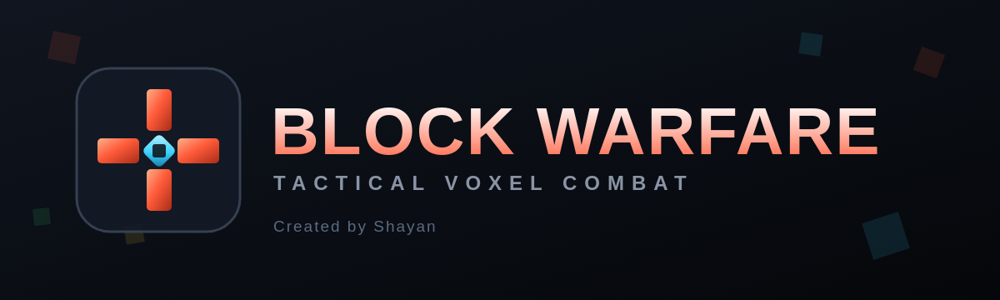

<p align="center">
  
</p>

# BLOCK WARFARE
### Created by Shayan

An original voxel/block-style tactical FPS — mobile-first controls, real
server-authoritative online multiplayer, offline bot matches, Team
Deathmatch + Battle Royale, and real 3D weapon models (AK-47, HK G28
sniper rifle, Colt Python revolver).

---

## 1. Put this on GitHub and get a live URL (GitHub Pages)

1. Create a new **public** GitHub repository and push everything in this
   folder to it (`index.html`, the `models/` folder, and `server/`) — keep
   the folder structure exactly as-is, since `index.html` loads the guns
   from `./models/*.glb` with relative paths.
2. In the repo, go to **Settings → Pages**.
3. Under "Build and deployment", set **Source** to `Deploy from a branch`,
   branch `main` (or `master`), folder `/ (root)`. Save.
4. After a minute, GitHub gives you a URL like:
   ```
   https://<your-username>.github.io/<repo-name>/
   ```
   That's your live, working game — open it on a phone and everything
   (menus, offline bot matches, weapon models, language toggle, settings)
   works immediately, no server required for any of that.

> Why this works better than a single HTML file: GitHub Pages serves real
> `https://` URLs, so the browser can `fetch()` the `.glb` model files and
> (for online play) open a secure WebSocket — neither works reliably when
> a page is opened directly from disk (`file://`).

## 2. Making "PLAY ONLINE" actually connect real players

`index.html` is only the client. Real cross-device multiplayer needs
`server/server.js` running somewhere reachable by every player's device —
GitHub Pages cannot run it (it's static hosting only), so it needs its own
home. The server decides score, eliminations, health and weapon-swaps —
clients report hits, the server validates and broadcasts the real result,
so it can't be faked from one device.

### Fastest real test (same WiFi, free, 2 minutes)
1. On a laptop: `cd server && npm install && node server.js`
   → prints `BLOCK WARFARE server listening on port 8080`
2. Find that laptop's LAN IP (`ipconfig` on Windows / `ifconfig` or
   `ip addr` on Mac/Linux) — something like `192.168.1.23`.
3. On each phone (same WiFi), open your GitHub Pages URL → **PLAY ONLINE**
   → enter `ws://192.168.1.23:8080` → **CONNECT**.
4. One phone taps **CREATE ROOM** (gets a 5-letter code), the other taps
   **JOIN ROOM** and enters it. Pick teams, ready up, leader taps
   **START MATCH** — this is real, server-synced multiplayer.

### Hosting the server publicly (works over mobile data, not just WiFi)
1. Free account on **Render.com** (Railway/Fly.io also work).
2. New **Web Service** → point it at the `server/` folder of this repo
   (or upload `server.js` + `package.json` directly).
3. Build command: `npm install` — Start command: `node server.js`.
4. You'll get a URL like `block-warfare-xyz.onrender.com`. In the game,
   enter:
   ```
   wss://block-warfare-xyz.onrender.com
   ```
   (`wss://`, not `ws://` — hosted platforms serve HTTPS, and a secure
   page can only open a secure WebSocket.)

Free tiers on some hosts sleep after inactivity — the first connection
after idling can take a few seconds to wake up.

---

## Repo structure
```
index.html            the whole client — menus, 3D engine, offline bots, online networking
models/
  ak-47.glb            used for assault rifle / SMG / LMG / shotgun view models
  hk-g28-sniper.glb     used for the sniper rifle
  colt-python.glb       used for the pistol
server/
  server.js            Node.js WebSocket server — rooms, teams, chat, and
                        server-authoritative scoring/damage/eliminations
  package.json          run `npm install` here before `node server.js`
```

## Notes on the weapon models
The three supplied models (AK-47, HK G28, Colt Python) cover all 6 weapon
slots — the AK-47 is reused (at different in-hand scale) for Assault
Rifle, SMG, LMG and Shotgun, since only one rifle-class asset was
provided. Each model's textures were resized/recompressed (they arrived
as 6–44 MB files with 4K textures meant for cinematic use, not a
real-time mobile view-model) down to ~0.6–2.5 MB each so they load fast
on a phone; geometry is untouched. Every weapon auto-fits itself to a
consistent first-person size/position at runtime — exact hand placement
may want small visual tweaks once you see it live (adjust the offsets in
`normalizeModelForView()` in `index.html`).

## What's server-authoritative vs. client-reported
- Score, eliminations, health/damage, and weapon-swap-on-kill are decided
  by `server.js`, not the client — clients report *hits*, the server
  validates/clamps the damage and broadcasts the real result to everyone.
- Player position/rotation are relayed as each client reports them (no
  full server-side physics) — standard for a lightweight FPS like this,
  not meant to defeat a determined cheater.
- Map geometry is generated identically and deterministically by every
  client from the map's name, so everyone sees the same world without the
  server sending any geometry data.
